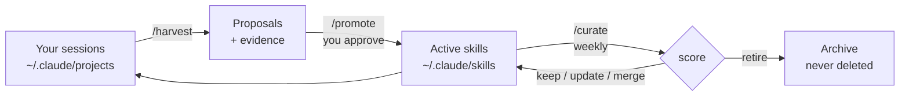

# 🌱 Second Nature

**Claude Code that grows with you.** Second Nature mines your own session history for work you keep repeating, drafts it into skills, and keeps your skill library curated over time — with you as the approval gate.

It brings the best idea from self-improving agents like [Hermes Agent](https://github.com/nousresearch/hermes-agent) (the agent writes its own skills from your patterns, a curator prunes them on a cycle) into Claude Code natively — no daemon, no separate memory, no new attack surface. And it adds the thing the self-improving agents are missing: **nothing self-installs.** Every generated skill passes through a human gate, with evidence attached.

## The loop



Three commands:

| Command | What it does |
|---|---|
| `/harvest` | Scans your recent sessions (default: last 14 days) for repeated multi-step work, re-explained instructions, and fiddly incantations. Drafts each as a proposal with an `EVIDENCE.md` — which sessions, how many occurrences, what it saves. |
| `/promote` | Shows pending proposals with their evidence. You approve, edit, or decline. Approved ones install as real skills (user- or project-level). This is the only path from draft to active. |
| `/curate` | Audits your whole skill library: usage (from transcripts), staleness (do referenced paths still exist?), overlap, quality. Proposes keep / update / merge / retire — applies only what you approve. Retired skills are archived, never deleted. |

## Install

**As a plugin** (recommended):

```
/plugin marketplace add mmusa/second-nature
/plugin install second-nature
```

**Or just copy the skills** — they're plain markdown:

```bash
git clone https://github.com/mmusa/second-nature.git
cp -r second-nature/skills/* ~/.claude/skills/
```

Then in any Claude Code session: `/harvest`.

## Make it automatic

The loop compounds when it runs on a schedule. Two native options:

- In Claude Code: `/schedule` a weekly routine that runs `/harvest` then `/curate`.
- Or plain cron/`claude -p`: `claude -p "/harvest then /curate" --permission-mode acceptEdits`

Harvest and curate only ever write to the proposal/archive directories on their own — installs and retirements still wait for your approval, so scheduling them is safe.

## Design principles

1. **Evidence-traced, human-gated.** Self-improving agents fail by confidently installing junk. Every Second Nature proposal carries evidence (sessions, occurrences, estimated savings), and a human approves every promotion and retirement. "The agent says it's useful" is never enough.
2. **Nothing is deleted.** Retired skills and declined proposals move to `~/.claude/second-nature/retired/`. You can always dig them back out.
3. **Secrets never travel.** Harvest is explicitly forbidden from copying secret values out of transcripts into skills — placeholders only.
4. **No new surface.** It's markdown instructions running inside Claude Code's existing permission model. No daemon, no server, no extra API keys, nothing listening on a port.

## State

Everything lives in `~/.claude/second-nature/`:

```
proposals/<slug>/SKILL.md      # drafted skill
proposals/<slug>/EVIDENCE.md   # why it was proposed
retired/                       # archived skills & proposals
LOG.md                         # append-only history
```

## FAQ

**How is this different from Hermes Agent / OpenClaw?** Those are standalone agent runtimes — a daemon with its own memory, channels, and (real, documented) security surface. Second Nature is not an agent; it's a growth loop for the agent you already run. If you live in Claude Code, you get the compounding without a second brain to secure.

**Does it phone home?** No. Everything is local files. There's no telemetry of any kind.

**What if harvest proposes something wrong?** Then you decline it at `/promote` and it never activates. That's the point of the gate.

## Credits

Inspired by the Autonomous Curator in [Hermes Agent](https://github.com/nousresearch/hermes-agent) by Nous Research, the skills ecosystem around [OpenClaw](https://github.com/openclaw/openclaw), and the "evidence-traced done" verification discipline. Built with Claude Code, for Claude Code.

## License

[MIT](LICENSE)
